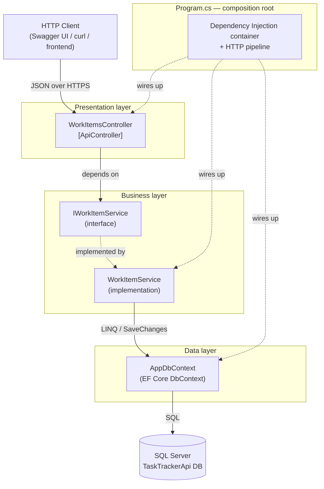
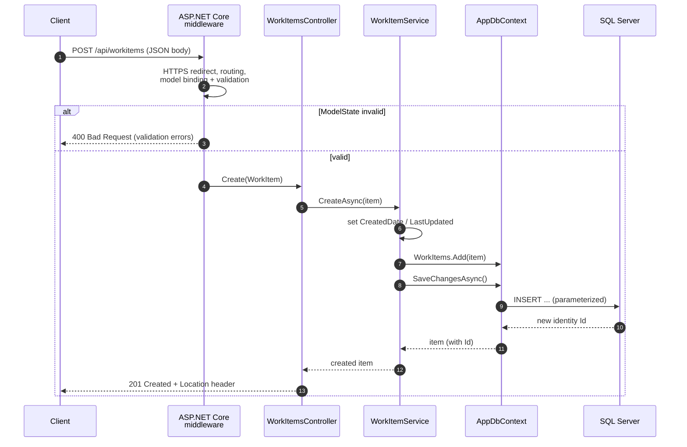
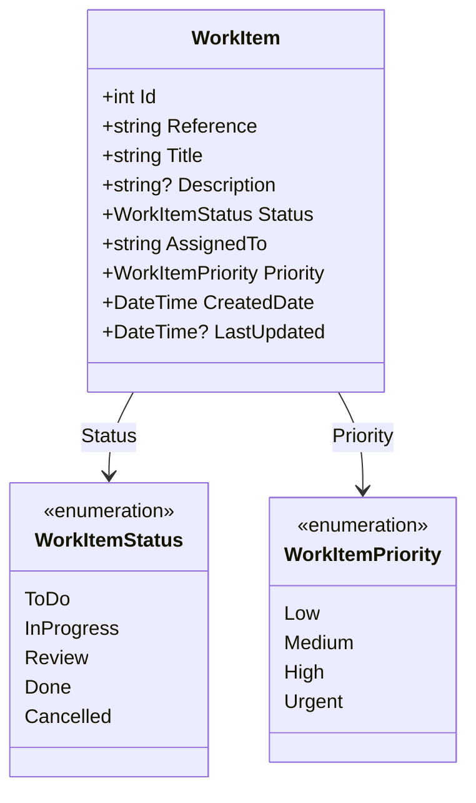
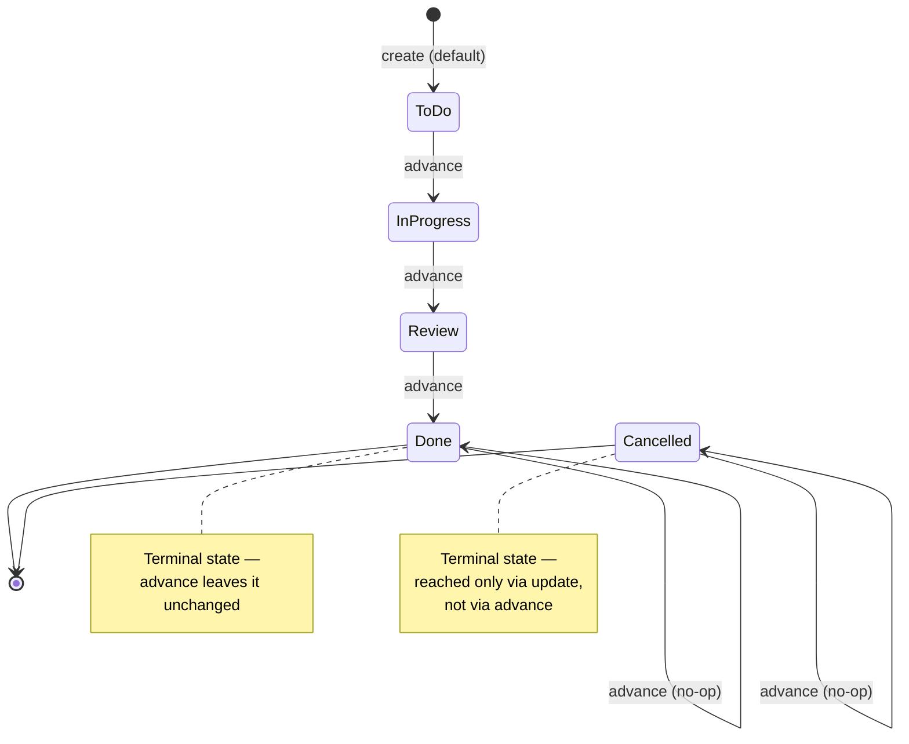
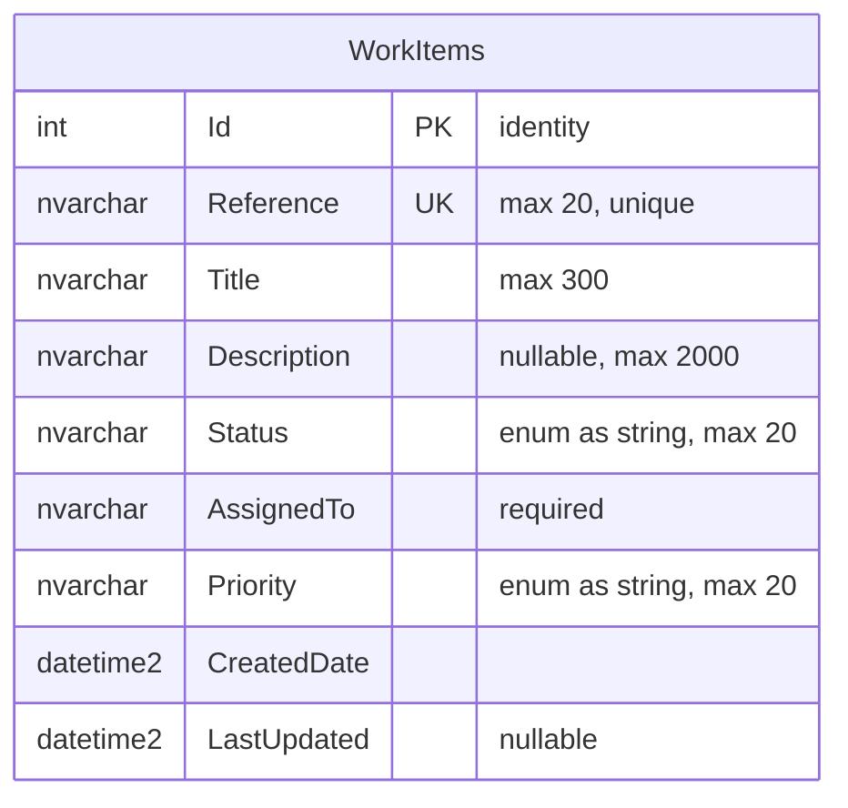
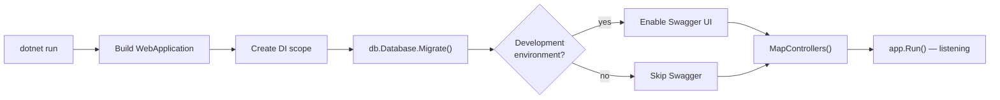

# Task Tracker API — Project Wiki

A compact, cleanly-layered **C# / ASP.NET Core** web API backed by **Microsoft SQL Server** that tracks work items through a simple workflow: **To Do → In Progress → Review → Done**.

This wiki is the single reference for the project's architecture, data model, request flow, API surface, and how to build, run, and test it.

---

## Table of contents

1. [Overview](#1-overview)
2. [Tech stack](#2-tech-stack)
3. [Solution layout](#3-solution-layout)
4. [Architecture](#4-architecture)
5. [Request lifecycle](#5-request-lifecycle)
6. [Domain model](#6-domain-model)
7. [Workflow state machine](#7-workflow-state-machine)
8. [Database schema](#8-database-schema)
9. [API reference](#9-api-reference)
10. [Configuration](#10-configuration)
11. [Getting started](#11-getting-started)
12. [Testing](#12-testing)
13. [Design decisions &amp; conventions](#13-design-decisions--conventions)
14. [Production hardening checklist](#14-production-hardening-checklist)

---

## 1. Overview

The Task Tracker API exposes standard **CRUD** operations for *work items* plus one domain-specific action — **`/advance`**, which moves an item to the next stage of its workflow. It is intentionally small and is meant to demonstrate a clean, layered .NET application with a relational SQL Server backend.

**Key characteristics**

- Layered architecture (presentation → business → data) with dependency injection throughout.
- Business logic isolated behind an interface (`IWorkItemService`) so it can be unit-tested without a database.
- EF Core code-first migrations; migrations are applied automatically on startup.
- Input validation via data annotations; a unique constraint on the reference code enforced at the DB level.
- Enums persisted as **readable strings** rather than integers.
- Swagger / OpenAPI UI for interactive exploration in development.

---

## 2. Tech stack

| Concern            | Choice                                                        |
| ------------------ | ------------------------------------------------------------- |
| Language / runtime | C# on**.NET 10** (`net10.0`)                          |
| Web framework      | ASP.NET Core Web API (controllers)                            |
| Persistence        | Microsoft SQL Server via**Entity Framework Core 10**    |
| Migrations         | EF Core code-first migrations                                 |
| API docs           | Swagger / OpenAPI (Swashbuckle)                               |
| Testing            | xUnit + EF Core**InMemory** provider (separate project) |

> **Note on framework version:** the project file targets `net10.0` and references EF Core `10.0.0`. The older `README.md` mentions .NET 8 — treat this wiki and the `.csproj` as the source of truth.

---

## 3. Solution layout

```
TaskTrackerApi/
├── Program.cs                 # Entry point: DI registration + HTTP pipeline
├── appsettings.json           # Connection string, logging config
├── TaskTrackerApi.csproj      # Web project (excludes Tests/ from its build)
│
├── Models/
│   └── WorkItem.cs            # Domain entity + WorkItemStatus / WorkItemPriority enums
├── Data/
│   └── AppDbContext.cs        # EF Core context: mapping, unique index, seed data
├── Services/
│   └── WorkItemService.cs     # IWorkItemService + implementation (business logic)
├── Controllers/
│   └── WorkItemsController.cs # REST endpoints (presentation layer)
├── Migrations/                # EF Core code-first migrations + model snapshot
│
└── Tests/                     # Separate xUnit project
    ├── TaskTrackerApi.Tests.csproj
    └── WorkItemServiceTests.cs
```

The `Tests/` folder is a **standalone xUnit project** that references the web project. The web project explicitly excludes `Tests/**/*.cs` from its own compilation so the two builds don't collide.

---

## 4. Architecture

The application is split into three layers plus the composition root (`Program.cs`). Each layer depends only on the layer below it, and dependencies are injected as interfaces — so any layer can be swapped or tested in isolation.



**Responsibilities**

| Layer        | Type                    | Responsibility                                                                   |
| ------------ | ----------------------- | -------------------------------------------------------------------------------- |
| Presentation | `WorkItemsController` | HTTP concerns: routing, status codes, model-state validation. No business logic. |
| Business     | `WorkItemService`     | All logic: create/update rules, timestamps, workflow transitions.                |
| Data         | `AppDbContext`        | Maps the domain model to SQL Server; owns the unique index and seed data.        |
| Composition  | `Program.cs`          | Registers services, applies migrations, configures the pipeline.                 |

**Dependency lifetimes** (registered in `Program.cs`):

- `AppDbContext` → **scoped** (one per request, via `AddDbContext`).
- `IWorkItemService` → **scoped** (`AddScoped`).

---

## 5. Request lifecycle

Below is a typical **create** request, showing how a call flows through the layers and back. Other endpoints follow the same shape.



**Status-code conventions used by the controller**

| Situation                            | Response                         |
| ------------------------------------ | -------------------------------- |
| Successful create                    | `201 Created` (+ `Location`) |
| Successful read                      | `200 OK`                       |
| Successful update / advance / delete | `204 No Content`               |
| Validation failure                   | `400 Bad Request`              |
| Item not found                       | `404 Not Found`                |

---

## 6. Domain model

The single entity is `WorkItem`, defined in [Models/WorkItem.cs](Models/WorkItem.cs).



**Field reference**

| Field           | Type                 | Rules / notes                                                           |
| --------------- | -------------------- | ----------------------------------------------------------------------- |
| `Id`          | `int`              | Primary key, database-generated identity.                               |
| `Reference`   | `string`           | **Required**, max 20 chars, **unique** (e.g. `TASK-101`). |
| `Title`       | `string`           | **Required**, max 300 chars.                                      |
| `Description` | `string?`          | Optional, max 2000 chars.                                               |
| `Status`      | `WorkItemStatus`   | **Required**, defaults to `ToDo`. Stored as a string.           |
| `AssignedTo`  | `string`           | **Required**.                                                     |
| `Priority`    | `WorkItemPriority` | Defaults to`Medium`. Stored as a string.                              |
| `CreatedDate` | `DateTime`         | Set by the service on create if not supplied (UTC).                     |
| `LastUpdated` | `DateTime?`        | Refreshed by the service on every create/update/advance (UTC).          |

---

## 7. Workflow state machine

The core piece of business logic is `AdvanceStatusAsync`, which moves an item one step forward through the workflow. `Done` and `Cancelled` are **terminal** — advancing them is a no-op (the call still succeeds).



> `Cancelled` is never *reached* by `advance`; an item enters it through an `UpdateAsync` that sets `Status = Cancelled`. Once cancelled, `advance` is a no-op.

---

## 8. Database schema

`AppDbContext` ([Data/AppDbContext.cs](Data/AppDbContext.cs)) maps the model to a single `WorkItems` table.



**Mapping details configured in `OnModelCreating`:**

- `Status` and `Priority` use `.HasConversion<string>()` — persisted as readable text (`"InProgress"`), not integers, with `HasMaxLength(20)`.
- `Reference` has a **unique index** (`.HasIndex(...).IsUnique()`), enforcing uniqueness at the database level.
- Two rows are **seeded** via `HasData` (`TASK-101`, `TASK-102`) so the API returns data on first run.

> The seed data is applied by SQL Server migrations. It is **not** applied under the in-memory provider used by the tests (which never calls `EnsureCreated`), so tests start from an empty table.

---

## 9. API reference

Base route: `/api/workitems` (from `[Route("api/[controller]")]`).

| Method | Route                           | Body         | Success        | Failure          |
| ------ | ------------------------------- | ------------ | -------------- | ---------------- |
| GET    | `/api/workitems`              | —           | `200` + list | —               |
| GET    | `/api/workitems/{id}`         | —           | `200` + item | `404`          |
| POST   | `/api/workitems`              | `WorkItem` | `201` + item | `400`          |
| PUT    | `/api/workitems/{id}`         | `WorkItem` | `204`        | `400`, `404` |
| POST   | `/api/workitems/{id}/advance` | —           | `204`        | `404`          |
| DELETE | `/api/workitems/{id}`         | —           | `204`        | `404`          |

Items are returned from `GET /api/workitems` **ordered by `Reference`**.

### Example: create a work item

```bash
curl -X POST https://localhost:5001/api/workitems \
  -H "Content-Type: application/json" \
  -d '{
        "reference": "TASK-200",
        "title": "Write project wiki",
        "assignedTo": "A. Developer",
        "priority": "High"
      }'
```

Response `201 Created`:

```json
{
  "id": 3,
  "reference": "TASK-200",
  "title": "Write project wiki",
  "description": null,
  "status": "ToDo",
  "assignedTo": "A. Developer",
  "priority": "High",
  "createdDate": "2026-07-04T12:00:00Z",
  "lastUpdated": "2026-07-04T12:00:00Z"
}
```

### Example: advance it one stage

```bash
curl -X POST https://localhost:5001/api/workitems/3/advance
# 204 No Content  →  status is now "InProgress"
```

---

## 10. Configuration

Configuration lives in [appsettings.json](appsettings.json). The important key is the connection string:

```json
"ConnectionStrings": {
  "DefaultConnection": "Server=localhost,1433;Database=TaskTrackerApi;User Id=sa;Password=...;TrustServerCertificate=True;"
}
```

- Points at a local SQL Server on port `1433` (e.g. the official SQL Server Docker image).
- `TrustServerCertificate=True` is for local development only.

> ⚠️ **Security:** the current file contains an inline `sa` password. For anything beyond local demos, move the connection string into **user secrets** or environment variables and keep credentials out of source control.

---

## 11. Getting started

### Prerequisites

- [.NET 10 SDK](https://dotnet.microsoft.com/download)
- A reachable **SQL Server** instance (Docker, LocalDB, Express, or full)
- EF Core CLI (if you want to run migrations manually): `dotnet tool install --global dotnet-ef`

### Run

```bash
# 1. restore dependencies
dotnet restore

# 2. run the app — migrations are applied automatically on startup
dotnet run
```

On startup `Program.cs` calls `db.Database.Migrate()`, so the schema and seed data are created without a manual step. To create/apply migrations by hand instead:

```bash
dotnet ef database update
```

Then open the Swagger UI (URL printed in the console, e.g. `https://localhost:5001/swagger`) to explore the API.



---

## 12. Testing

Tests live in the separate **`Tests/`** xUnit project and exercise `WorkItemService` against the EF Core **in-memory** provider — no SQL Server required. Each test gets its own uniquely-named in-memory database, so tests are fully isolated.

```bash
# run the test suite (no .sln file, so point at the test project)
dotnet test Tests/TaskTrackerApi.Tests.csproj
```

**Coverage** ([Tests/WorkItemServiceTests.cs](Tests/WorkItemServiceTests.cs)):

| Method                 | Cases                                                                                        |
| ---------------------- | -------------------------------------------------------------------------------------------- |
| `CreateAsync`        | persists + assigns`Id`; sets timestamps when absent; preserves a supplied `CreatedDate`  |
| `GetAllAsync`        | empty result; ordering by`Reference`                                                       |
| `GetByIdAsync`       | found;`null` when missing                                                                  |
| `UpdateAsync`        | mutates all fields + refreshes`LastUpdated`; `false` when missing                        |
| `DeleteAsync`        | removes item;`false` when missing                                                          |
| `AdvanceStatusAsync` | ToDo→InProgress→Review→Done transitions; terminal states unchanged;`false` when missing |

The tests follow the **Arrange–Act–Assert** pattern and use `[Theory]` for the state-machine transitions.

---

## 13. Design decisions & conventions

- **Interface-first services.** Controllers depend on `IWorkItemService`, never the concrete class — keeps the web layer decoupled and mockable.
- **Thin controllers.** No business rules in controllers; they only translate between HTTP and the service. `[ApiController]` gives automatic model-state validation.
- **Timestamps owned by the service.** `CreatedDate` / `LastUpdated` are set in `WorkItemService`, not trusted from the client, so they're always consistent and UTC.
- **Enums as strings.** More readable in the database and resilient to reordering enum members.
- **Uniqueness at the database level.** The `Reference` unique index guarantees integrity even if application code has a bug.
- **Separate test project.** Test-only dependencies (xUnit, EF InMemory) stay out of the deployable web app; the web `.csproj` excludes `Tests/**`.
- **Auto-migrate on startup.** Convenient for a demo. In production you'd typically run migrations as a controlled deployment step instead.

---

## 14. Production hardening checklist

This is a demonstration project. Before running it for real, consider adding:

- [ ] **Authentication & authorization** (JWT / OAuth).
- [ ] **DTOs** to separate the API contract from the EF entity (avoid over-posting).
- [ ] **Pagination & filtering** on `GET /api/workitems`.
- [ ] **Structured logging** and health checks.
- [ ] **Global exception handling** / problem-details responses.
- [ ] **Secrets management** — move the connection string out of `appsettings.json`.
- [ ] **Controlled migrations** rather than auto-migrate on startup.
- [ ] **CI pipeline** running `dotnet test` on every push.
- [ ] Pin the transitive `System.Security.Cryptography.Xml` advisory flagged during test restore.

---

*Generated as the canonical project wiki. Keep this file in sync with the code — especially the API table, the state machine, and the schema — when behaviour changes.*
